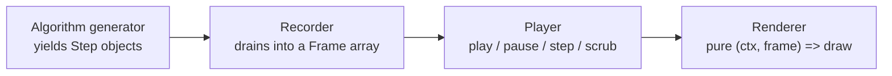

# AlgoCanvas

**Watch algorithms think** — not "watch bars move." Pause before Quick Sort picks a side for its pivot, predict which partition it lands in, then find out why you were right or wrong. Step through Bellman-Ford relaxing a negative-weight edge and get a plain-English sentence explaining exactly why that number just changed.

AlgoCanvas is a from-scratch algorithm visualizer: 27 algorithms, 218 tests, zero charting or animation libraries — just React, TypeScript, and a `<canvas>` that draws exactly what the algorithm actually did, one frame at a time.

## Why this exists

Most algorithm visualizers are either a hardcoded GIF pretending to be interactive, or a slick front end wrapped around logic nobody bothers to verify. This is neither:

- Every algorithm is a real **generator function** — the actual algorithm runs, yielding a description of each step, not a script faking a sort while a separate layer animates.
- Every non-obvious claim is checked against an independent source, not just against itself: Bellman-Ford's final distances are cross-checked against Dijkstra; Prim's MST weight is cross-checked against a brute-force search over every spanning tree; a Red-Black tree's rotations are hand-traced before the test that asserts them is written.
- Every visual feature is driven through a real (headless) browser across all 27 algorithms before it's committed — "it compiles" has never been the bar here.

## What's inside

| Family | Algorithms |
|---|---|
| Comparison sorts | Bubble, Selection, Insertion, Quick, Merge, Heap |
| Non-comparison sorts | Counting, Radix, Bucket |
| Searching | Linear, Binary, Jump, Interpolation |
| Graphs | BFS, DFS, Dijkstra, Bellman-Ford, Prim's MST, Kruskal's MST |
| Trees | Binary Tree, BST, AVL, Red-Black, B-Tree, Trie |
| Hashing | Hash Table (separate chaining) |
| Dynamic Programming | Longest Increasing Subsequence |

None of them run on a fixed demo dataset — every one takes **your** input: type an array, sketch a graph (negative edge weights included, if you pick the one algorithm that handles them correctly), list some words for the Trie, or describe a tree shape LeetCode-style (`1, 2, 3, null, null, 4, 5`).

## Beyond play/pause

- **"Think Like the Algorithm"** — a predict mode that pauses at real decision points (a Quick Sort pivot comparison, an AVL rotation) and asks you to call it before revealing the answer.
- **Plain-English step explanations** — every algorithm, every step, explained in a sentence a human wrote — and one that actually knows the difference: Quick Sort's "compare" step means something different from Merge Sort's, and the explanation says so.
- **A real theme system** — five presets (Light, Dark, Night, Ocean, Sunset) plus a color manager where every individual color can be overridden and persists across reloads.
- **Custom input everywhere**, validated per algorithm: Dijkstra rejects negative edges with a clear error; Bellman-Ford accepts them and can detect the negative cycle they create.

## Architecture

Every algorithm is a generator that `yield`s a **step** — a description of what changed, never how to draw it:

```ts
function* bubbleSort(input: number[]): Generator<SortStep> {
  const arr = [...input]
  for (let i = 0; i < arr.length - 1; i++) {
    for (let j = 0; j < arr.length - 1 - i; j++) {
      yield { type: 'compare', indices: [j, j + 1] }
      if (arr[j] > arr[j + 1]) {
        ;[arr[j], arr[j + 1]] = [arr[j + 1], arr[j]]
        yield { type: 'swap', indices: [j, j + 1] }
      }
    }
  }
  yield { type: 'done' }
}
```



A **recorder** drains the generator once into an array of frames — the entire trick behind instant rewind and scrubbing is that there's no "running the algorithm backwards," just indexing into an array that was already computed.

A **renderer** is a pure function of the current frame. It doesn't know what a bubble sort is; it just draws whatever that frame says happened. Swap in a different renderer and the same recorded frames could drive a completely different visual.

This split is also why the test suite doesn't need a browser, a canvas mock, or a DOM: a generator that just yields data is trivial to assert against directly.

## Getting started

```bash
npm install
npm run dev
```

```bash
npm test         # 218 tests, pure logic - no browser required
npm run test:watch
npm run lint      # oxlint
npm run build     # typecheck + production build
```

## The build process

This wasn't built as one feature dump. [PRD.md](PRD.md) has the real product spec and the phase-by-phase roadmap it was built against — including the pivot partway through from "watch 16 fixed demos" to "bring your own problem," which is the reason most of the architecture above exists at all. Every phase landed as its own verified, tested, committed slice.

## Stack

React 19 + TypeScript + Vite, rendering straight to a `<canvas>` 2D context. No charting library, no animation library, no CSS framework.
